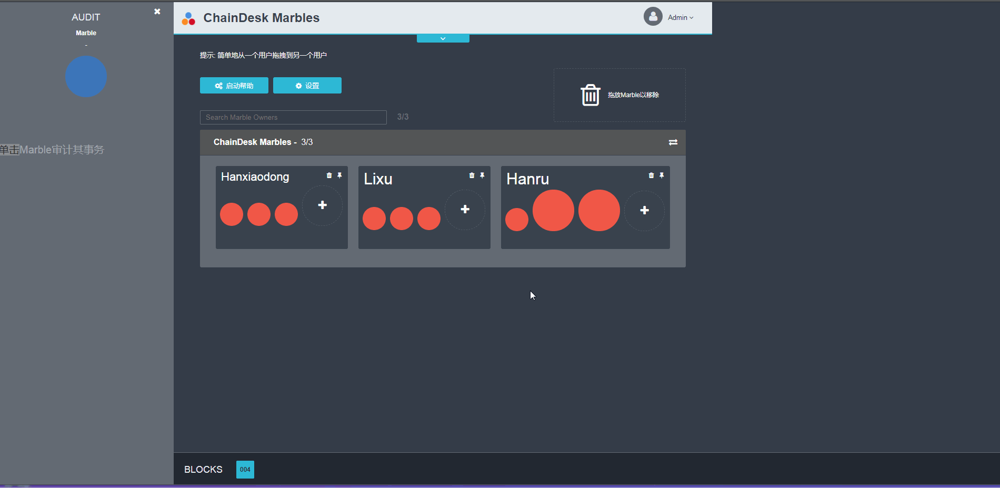

本示例是根据IBM提供的Marbles项目，具体分析如何基于Hyperledger Fabric利用fabric-sdk-node实现一个web应用

首先我们先来看一下应用程序的实际运行效果：

此应用程序将演示如何利用 Hyperledger Fabric 在许多Marble所有者之间转移Marble。 我们将在 Node.js 中使用一些 GoLang 代码完成此任务。 该应用程序的后端将在Hyperledger Fabric网络中运行的 GoLang 代码。 这些 GoLang 代码将称为“链代码”或“cc”。 该链代码本身会创建一个Marble，并将其存储到链代码状态中。 该链代码本身可以将数据作为字符串存储在键/值对设置中。 因此，需要将字符串转化成为 JSON 对象，以便于在账本中存储更复杂的数据结构。

具体实现过程如下：

1. [网络环境搭建](./md/1. 网络环境搭建.md)
2. [编写链码](./md/2. 编写链码.md)
3. [设置环境－网络连接信息](./md/3. 设置环境-网络连接信息.md)
4. [设置环境－连接概要库](./md/4. 设置环境-连接概要库.md)
5. [设置环境－连接概要库入口](./md/5. 设置环境-连接概要库入口.md)
6. [sdk-node之链码安装及实例化](./md/6. sdk-node之链码安装及实例化.md)
7. [调用链码安装及实例化脚本](./md/7. 调用链码安装及实例化脚本.md)
8. [测试](./md/8. 测试.md)
9. [sdk-node之实现事务与查询](./md/9. sdk-node之实现事务与查询.md)
10. [调用链码实现事务与查询脚本](./md/10. 调用链码实现事务及查询脚本.md)
11. [服务器端脚本](./md/11. 服务器端脚本.md)
12. [web实现](./md/12. web实现.md)
13. [启动web应用](./md/13. 启动Web应用.md)
14. [交互演示](./md/14. 交互演示.md)

