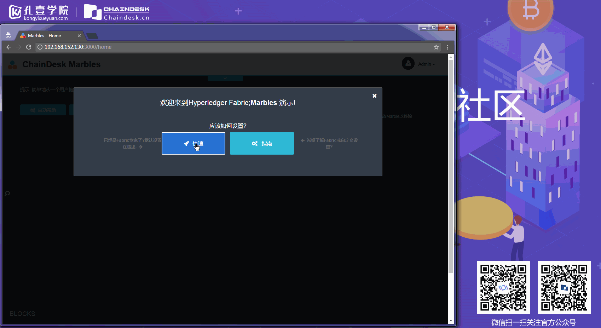
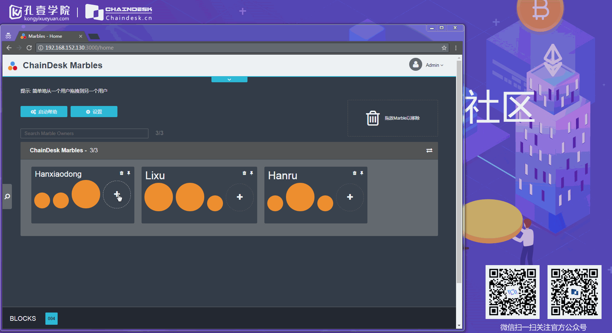
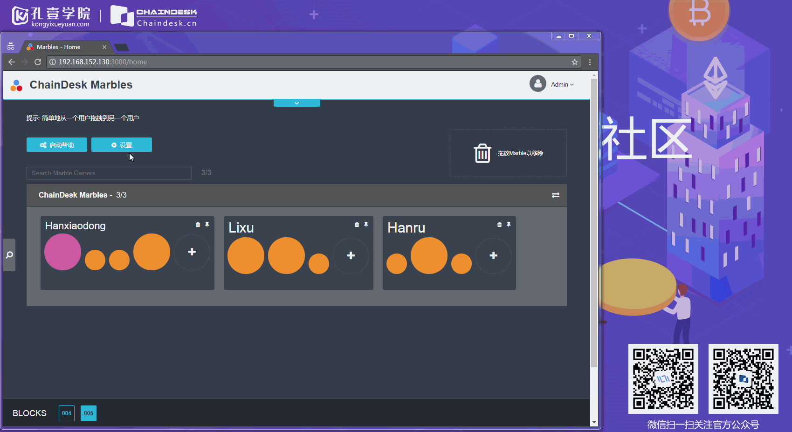
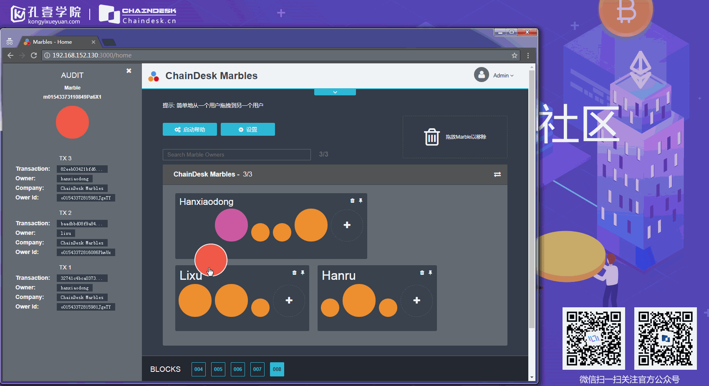
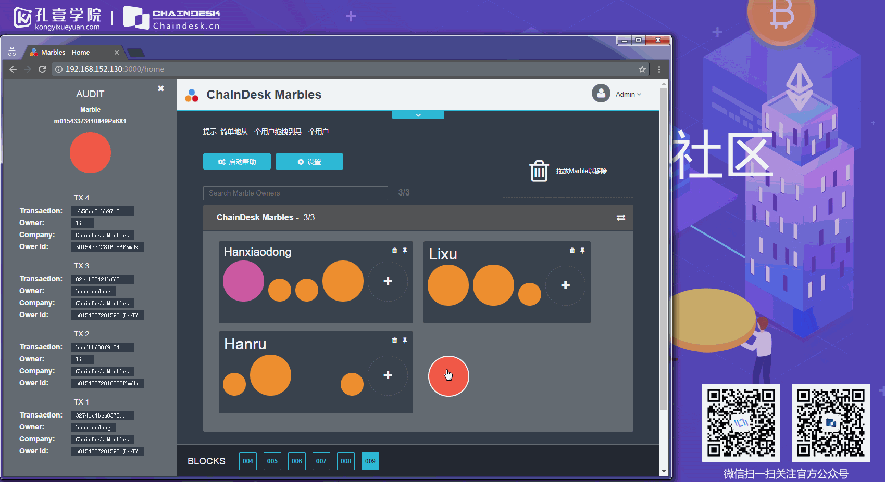

## 从零到壹实现Marbles资产管理系统 （Fabric-SDK-Node）之－交互演示

应用启动之后，打开浏览器，在地址栏中输入：http://localhost:3000 进行访问

首先进入的是应用的初始设置页面，我们可以直接点击 “快速” 按钮，让应用根据启动时指定的配置文件自动创建相关的初始数据。

初始化完毕之后，应用中有三个用户，每个用户拥有三个Marble，我们可以对其中的用户进行创建Marble资产的操作

可以通过单击页面中的 “设置” 按钮，用来启用事务描述模式，

事务描述模式开启之后，就可以看到每个事务详细的执行过程：

可以将指定用户的资产转移给其他用户，直接将Marble拖拽到指定用户即可

也可以将指定用户的Marble进行删除，将指定用户拥有的Marble拖拽到垃圾箱中即可完成。

### 参考资料

- [Hyperledger 官网](https://www.hyperledger.org/)
- [Hyperledger Fabric 在线文档](https://hyperledger-fabric.readthedocs.io/en/latest//)
- [Hyperledger Fabric-SDK-Node](https://github.com/hyperledger/fabric-sdk-node)
- [Node SDK documentation](https://fabric-sdk-node.github.io/)
- [IBM-Blockchain-marbles](https://github.com/IBM-Blockchain/marbles)